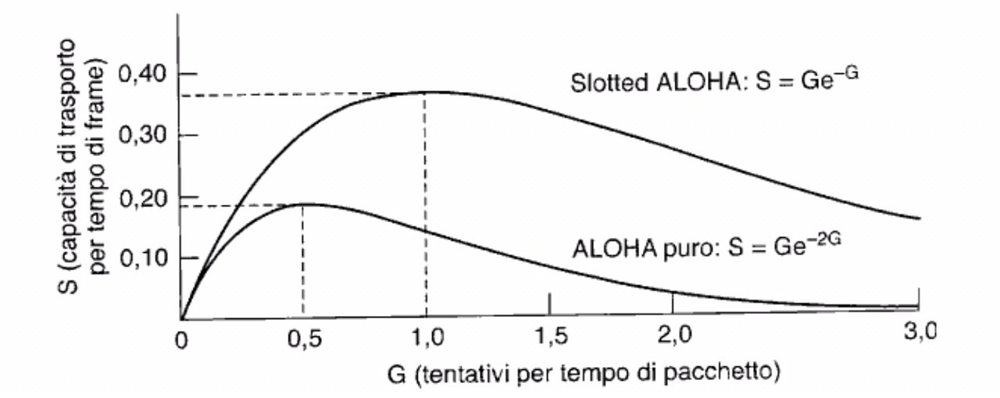

## Protocolli ad accesso multiplo  
Sono protocolli in cui vi e' competizione per le risorse, in soldoni, vi e' un unico canale condiviso da molti. I protocolli per assegnare l'uso di un canale multiaccesso appartengono a un sottostrato dello strato collegamento dati, chiamato **MAC** (*Medium Access Control* ). I sistemi a competizione sono utili quando il traffico sulla rete e' irregolare ( praticamente sempre ), se ad esempio utilizzassimo FDM (o TDM) per la trasmissione sullo stesso canale di piu' utenti, presupponendo di aver diviso lo spettro in N regioni, nel caso ci fossero meno di N utenti a trasmettere stiamo sprecando banda, nel caso ci fosser piu' di N utenti a trasmettere allora parte di essi non sarebbero in grado di trasmettere.  
**Premesse**:  
1. Modello della stazione => vi sono N stazioni indipendenti, quando una stazione ha generato un frame, essa non fa nulla fino a che il frame e' stato spedito con successo.  
1. Presupposto del canale => Un solo canale viene utilizzato per tutte le trasmissioni.  
1. Presupposto della collisione => se due frame si sovrappingono ( anche parzialmente ) entrambi i fram sono distrutti.  
1. Tempo continuo => non vi e' un orologio centralizzato che scandisce i tempi per la trasmissione, chiunque puo' rasmettere appena ha frae da inviare.  
   Tempo diviso in slot=> vi e' un orologio centralizzato che scandisce i tempi ( la suddivisione in slot ) per la trasmissione, la trasmissione di un frame coincide con l'inizio dell'intervallo  
1. carrier sensitive => Una stazione  puo' verificare se il canale e' in uso oppure no.  
   non carrier sensitive => Una stazione non puo' cvapire se il canale e' in uso oppure no.  
### Aloha  puro  
L'idea di fondo è: quando una stazione ha qualcosa da trasmettere, trasmette, senza preoccuparsi delle conseguenze (quindi senza ascoltare il canale prima di trasmettere). Una stazione può accorgersi ascoltando il canale se la comunicazione è andata a buon fine. Se il pacchetto collide, la stazione rimane in attesa per un tempo casuale prima di trasmettere.  
**Qual è la probabilità che ci sia qualcun altro nella linea che strasmettere, compromettendo quindi entrambi i paccheti trasmessi?**    
Presupponiamo che vengano generati N frame per tempo di frame (tempo di trasmissione di un frame (s/c)). Se N>1 si stanno generando una quantità di frame che il canale non è in grado di gestire, data la troppa frequenza con cui vengono generati, assumiamo quindi 0<N<1.  
Le stazioni dovranno ristrasmettere i frame che hanno colliso, suponiamo una probabilità di k tentativi per tempo di frame, con una media di G frame per tempo di frame.  
La probabilità che k frame siano generati in un periodo di tempo t è: `Pr[k] = ((G^k)e^-G)/k!`, perciò la probabiltà che non vengano generati altri frame durante il perido t è `e^-G`.    
In un intervallo lungo due tempi di frame (2t), la media dei frame generati per tempo di frame è pari a 2G. Il periodo di vulnerabilità del nostro frame è tra t0 a t0+2t, la probabilità che in questo intervallo non vengano generati altri frame è pari a `e^-2G`.  
La capacità di trasporto massima si ha con G=0.5 => sostituendo G alla formula trovo che la probabilità che le cose vadano bene per il mio frame sono del 18,4%. La cosa che alletta però è la scbilità del sistema, nella formula non compare infatti la quantità di terminali che trasmettono, il 18,4% rimane così costante all'aumentare dei dispositivi che si aggiungono alla rete.  
**NB** => si è notato che utilizzando in Aloha pacchetti di lunghezza fissa si hanno generalmente prestazioni migliori.  
### Aloha slotted  
Con Aloha slotted si ha un orologio sincronizzato centralmente che ci indica quando si può cominciare a trasmettere. Possiamo così avere sovrapposizioi di pacchetti solo nel caso in cui ci fossero atri pacchetti nello slot in cui vogliamo trasmettere. Quindi, il tempo di vulnerabilità è dimezzato, viene così raddoppiata la probabilità di una trasmissione a buon fine, in formula: `Ge^-G` ( dove G è la media dei frame generati in un tempo di frame, ed e^-G è la probabilità di successo), arrivando così al 36,8%. Aloha slotted ha una capacita' massim con `G=1`.  
**aloha a confronto**:  

**NB** => entrambi i protocolli visti fino ad ora **non possiedono il carrier sensitive**.  
**CSMA** => carrier sensistive multiple access.  
### 1-Persistente CSMA  
Quando una stazione ha un frama da trasettere, per prima cosa ascolta il canale per capire se qualcun altro sta trasmettendo in quel momento; se il canale è occupato, la stazione aspetta fin che non si libera; una volta che il canale è libero, la stazione comincia a trasmettere. In caso di collisione, la stazione aspetta un tempo casuale prima di cominciare a trasmettere. 1 persistant perchè spediamo i pacchetti il 100% delle volte. La probabilità che un frame venga inviato correttamente è più del 50%.  
**Problema** => può essere che ad un certo momento tutte le stazioni stiano aspettando che il canale di liberi per trasmttere un frame. In tal caso tutti i frame verranno distrutti. Il motivo alla base di tale comportamento è che tramite l'attesa stiamo creando sincronizzazione.  
### CSMA non persistente  
Prima di trasmettere ogni stazione controlla il canale (come prima), se il canale è occupato non eseguo un controllo continuo fino a quando il canale si libera, ma aspetta un tempo casuale e poi ricontrolla il canale.  
### CSMA p-Persistente  
Una stazione rimane in ascolto del canale fino a quando non si libera ( infatti è persistente ) e poi trasmette i frame con probabilità **p**. In caso di collisione si attende un intervallo di tempo casuale.  
**Sunto tramite grafico delle prestazioni**  

### CSMA/CD  
CSMA con *Collision Detection*, le stazioni possono accorgersi che vi è stato una collisione, e al posto di continuare a trasmettere frame che verranno da li a poco distrutti, interrompono la trasmissione. CSMA/CD è alla base delle comunicazioni Ethernet in LAN.   
